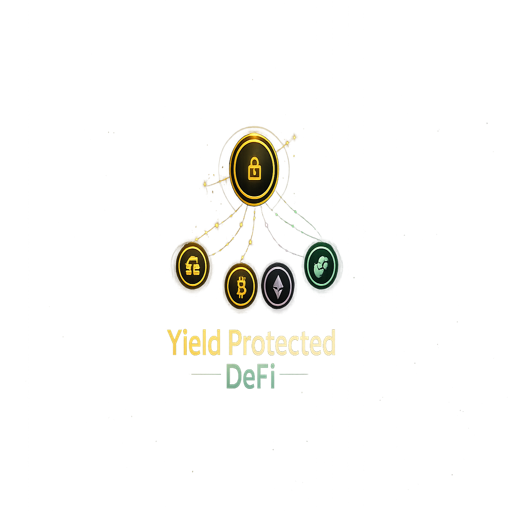

<div align="center">
  
  <h1>YOLDR</h1>
  <p><strong>You Only Lose (the) yield, Really.</strong></p>
  <p>Principal-protected DeFi on Flow — your savings stay home while your yield goes adventuring.</p>

  <a href="https://yoldr.vercel.app/"></a>
  <a href="https://testnet.flowscan.io/account/0x8401ed4fc6788c8a"></a>
  <a href="https://github.com/CodeswithrohStudio/yoldr"></a>
</div>

---

## 🔗 Live Deployment

| | URL |
|---|---|
| **Web App** | https://yoldr.vercel.app/ |
| **GitHub** | https://github.com/CodeswithrohStudio/yoldr |
| **Flow Testnet Explorer** | https://testnet.flowscan.io/account/0x8401ed4fc6788c8a |

---

## 🧩 Problem Statement

DeFi has a participation problem — not a yield problem.

Most people understand that crypto can generate high returns. What stops them is the **fear of loss**. A single bad trade can wipe out months of savings. Liquidations happen in minutes. Leverage is dangerous. And the complexity of managing positions is a full-time job.

At the same time, traditional savings accounts earn almost nothing. People are stuck choosing between:

- 💸 **High yield, high risk** — leveraged DeFi positions that can blow up
- 🏦 **Safe but worthless** — stablecoins and savings accounts that can't beat inflation

There is no middle ground. **Until now.**

---

## ✅ Solution

**Yoldr** separates your principal from your risk. Here's how:

> **Your principal is locked in a vault. Forever safe. Only your daily yield ever leaves.**

Using zero-coupon bond mathematics, Yoldr calculates exactly how much yield is needed to guarantee the return of your full deposit. That yield — and only that yield — is used to fund **Shield positions**: leveraged bets on Gold, BTC, ETH, and FLOW.

- 📈 **If the shield wins** → you earn multiplied returns on top of your principal
- 📉 **If the shield loses** → you lose only the yield. Your principal comes home.

This isn't a new concept in traditional finance — it's the same math behind structured notes and principal-protected funds. Yoldr brings it on-chain, trustlessly, on Flow.

---

## 🏗 Architecture

```
┌─────────────────────────────────────────────────────────────────┐
│                        USER (Flow Wallet)                        │
└──────────────────────────────┬──────────────────────────────────┘
                               │ deposit FLOW
                               ▼
┌─────────────────────────────────────────────────────────────────┐
│                      Yoldr.cdc (Core Vault)                      │
│                                                                  │
│  • Locks principal (zero-coupon guarantee)                       │
│  • Accrues yield at 5% APY (simulated, testnet)                  │
│  • harvestYield() → returns accrued amount for shield margin     │
│  • Streak tracking, XP points, rebalance engine                  │
└────────────┬──────────────────────────┬─────────────────────────┘
             │ yield flows              │ principal locked
             ▼                         ▼
┌─────────────────────┐    ┌───────────────────────────────────────┐
│  ShieldPosition.cdc │    │         MockPriceFeed.cdc             │
│                     │    │                                       │
│  NFT per position   │    │  On-chain price oracle for:           │
│  GOLD / BTC / ETH / │◄───│  GOLD, BTC, ETH, FLOW                │
│  FLOW at 1x–5x lev  │    │  (updateable by admin tx)            │
│                     │    └───────────────────────────────────────┘
│  openShield()       │
│  P&L calculated     │
│  from price delta   │
└────────────┬────────┘
             │ on close
             ▼
┌──────────────────────┐       ┌──────────────────────────────────┐
│   BadgeMinter.cdc    │       │         VaultPet.cdc             │
│                      │       │                                  │
│  Mints Shield Badge  │       │  NFT companion bonded at deposit │
│  NFT on position     │       │  Griffin / Dragon / Phoenix /    │
│  close with P&L      │       │  Narwhal                         │
│  metadata on-chain   │       │  Gains XP, levels up, evolves    │
│  isRare if >20% ret  │       │  Mood reflects live shield P&L   │
└──────────────────────┘       └──────────────────────────────────┘
```

### Frontend Stack

```
Next.js 14 (App Router)
├── FCL (Flow Client Library)    — wallet auth, on-chain reads/writes
├── Zustand                      — client state (vault, pet, positions)
├── Framer Motion                — animations, loading screens
├── Three.js                     — landing page 3D scene
├── Tailwind CSS                 — styling
└── Vercel                       — deployment
```

---

## 📜 Deployed Contracts (Flow Testnet)

All contracts are deployed to a single account on Flow Testnet:

**Account:** [`0x8401ed4fc6788c8a`](https://testnet.flowscan.io/account/0x8401ed4fc6788c8a)

| Contract | Address | Description |
|---|---|---|
| `Yoldr` | `0x8401ed4fc6788c8a` | Core vault — deposits, yield accrual, withdrawal |
| `ShieldPosition` | `0x8401ed4fc6788c8a` | NFT representing an open leveraged position |
| `VaultPet` | `0x8401ed4fc6788c8a` | Companion NFT bonded to vault at deposit |
| `BadgeMinter` | `0x8401ed4fc6788c8a` | Shield Badge NFT minted on position close |
| `MockPriceFeed` | `0x8401ed4fc6788c8a` | On-chain price oracle for GOLD / BTC / ETH / FLOW |

**Standard dependencies:**

| Contract | Address |
|---|---|
| `NonFungibleToken` | `0x631e88ae7f1d7c20` |
| `FungibleToken` | `0x9a0766d93b6608b7` |
| `FlowToken` | `0x7e60df042a9c0868` |

---

## 🛡 Shield Types

| Shield | Asset | Leverage | Expected APY | Guardian Pet |
|---|---|---|---|---|
| Gold Guardian | GOLD / USD | 5× | ~5.8% | 🦁 Griffin |
| Crypto Cruiser | BTC / USD | 1× spot | ~30% | 🐉 Dragon |
| Ether Voyager | ETH / USD | 2× | ~20% | 🦅 Phoenix |
| Flow Rider | FLOW / USD | 3× | ~25% | 🦄 Narwhal |

---

## ⚡ Why Flow

Yoldr is built on Flow because the product requires specific blockchain properties that most chains can't deliver:

### 1. Resource-Oriented Programming (Cadence)
Every asset in Yoldr — vault positions, pet NFTs, shield badges — is a **Cadence resource**. Resources cannot be accidentally duplicated or destroyed. A Shield Position NFT *is* the position; it holds its own state and can only exist in one place at a time. This makes the principal-protection guarantee **mathematically enforceable in the smart contract itself**, not just promised in documentation.

### 2. Account Model with Capabilities
Flow's capability-based access control lets Yoldr publish minter interfaces as public capabilities on the contract account (`/public/vaultPetMinter`, `/public/shieldPositionMinter`, `/public/badgeMinter`). This means any signed transaction can mint NFTs through a controlled interface — no approvals, no allowances, no ERC-20 style footguns.

### 3. Fast Finality at Low Cost
Yoldr's user loop is: deposit → open shield → wait → close → collect badge → repeat. Each step is a transaction. On Flow Testnet, these confirm in ~2–5 seconds for fractions of a cent. A product like Yoldr is **unusable on Ethereum mainnet** where a single deposit could cost $20–$80 in gas. Flow makes the micro-interaction loop viable.

### 4. Consumer-Grade Wallet UX
Flow Client Library (FCL) lets users connect with Blocto, Lilico, or WalletConnect in seconds — no seed phrase required if using Blocto's custodial option. The target user for Yoldr is **not a DeFi power user**; it's someone who wants safety with upside. FCL's one-tap wallet connection removes the biggest onboarding barrier.

### 5. NFTs as First-Class Financial Instruments
Yoldr uses NFTs not as collectibles but as **financial primitives**:
- `ShieldPosition` NFT = the actual leveraged position (transferable, composable)
- `VaultPet` NFT = your on-chain streak and XP tracker (evolves with behaviour)
- `BadgeMinter` NFT = immutable trade history with P&L recorded on-chain

Flow's `NonFungibleToken` standard and Cadence's resource model make this natural. On EVM chains this would require complex workarounds to prevent double-spend on position NFTs.

### 6. Ecosystem Alignment
Flow is building toward consumer DeFi. Yoldr is exactly that — a DeFi product designed for people who have never opened MetaMask. The Flow ecosystem's focus on gaming, entertainment, and consumer apps means the future users Yoldr wants to reach are already coming to Flow.

---

## 🚀 Getting Started (Local Dev)

### Prerequisites
- Node.js 18+
- Flow CLI (`brew install flow-cli`)
- A Flow testnet account with FLOW (get free FLOW from [faucet.onflow.org](https://faucet.onflow.org))

### Install & Run

```bash
git clone https://github.com/CodeswithrohStudio/yoldr.git
cd yoldr
npm install
npm run dev
```

Open [http://localhost:3000](http://localhost:3000).

### Cadence Transactions

All transactions are in `cadence/transactions/`. Key admin commands:

```bash
# Update mock price feed (admin only)
flow transactions send cadence/transactions/updatePrice.cdc "BTC" 95000.0 \
  --network testnet --signer testnet-account

# Setup minter capabilities (run once after deploy)
flow transactions send cadence/transactions/setupMinters.cdc \
  --network testnet --signer testnet-account
```

### Environment

No `.env` needed — all contract addresses are hardcoded for testnet in `src/lib/flow.ts`. WalletConnect project ID is pre-configured.

---

## 📁 Project Structure

```
yoldr/
├── cadence/
│   ├── contracts/
│   │   ├── Yoldr.cdc              # Core vault contract
│   │   ├── ShieldPosition.cdc     # Leveraged position NFT
│   │   ├── VaultPet.cdc           # Companion pet NFT
│   │   ├── BadgeMinter.cdc        # Shield badge NFT
│   │   └── MockPriceFeed.cdc      # On-chain price oracle
│   └── transactions/
│       ├── deposit.cdc            # Create vault + mint pet
│       ├── openShield.cdc         # Open leveraged position
│       ├── closeShield.cdc        # Close position + mint badge
│       ├── withdraw.cdc           # Withdraw principal
│       ├── updatePrice.cdc        # Admin: update mock prices
│       └── setupMinters.cdc       # Admin: publish capabilities
├── src/
│   ├── app/
│   │   ├── page.tsx               # Landing page
│   │   └── app/
│   │       ├── page.tsx           # Dashboard
│   │       ├── shields/           # Shield selector
│   │       ├── badges/            # Badge collection
│   │       └── leaderboard/       # Global leaderboard
│   ├── components/
│   │   ├── DepositLoadingScreen   # Storytelling TX loader
│   │   ├── VaultPetDisplay        # Pet with live mood states
│   │   ├── YoldrFlowDiagram       # Animated SVG explainer
│   │   ├── BottomNav              # Mobile navigation
│   │   ├── StreakBar              # XP / streak display
│   │   └── ToastNotifications     # Transaction feedback
│   ├── lib/
│   │   └── flow.ts                # FCL config + all Cadence inline
│   └── store/
│       └── useYoldrStore.ts       # Zustand global state
├── public/
│   ├── logo.png                   # Yoldr logo
│   ├── og-image.png               # Open Graph share card
│   └── manifest.json              # PWA manifest
└── flow.json                      # Flow CLI project config
```

---

## 🎮 Gamification Layer

Yoldr is built on the belief that **good financial habits should feel like a game**.

| Mechanic | How it works |
|---|---|
| **Vault Pet** | Choose your guardian at first deposit. It levels up with XP from every action. |
| **Mood System** | Pet animation reflects live P&L — bounces when winning, shakes when taking hits |
| **Daily Feed** | Tap your pet once a day. Keeps your streak alive. Earns +10 XP. |
| **Streak Counter** | Consecutive daily check-ins multiply your yield bonus |
| **Shield Badges** | Every closed position mints a permanent on-chain badge with trade stats |
| **Rare Badges** | Positions with >20% return mint a rare badge (`isRare: true` on-chain) |
| **Skin Evolution** | Pet evolves: base → silver (Lv.10) → gold (Lv.25) → legendary (Lv.50) |
| **XP System** | Deposit: +100 XP · Open Shield: +50 XP · Close Shield: +75 XP |

---

## 📄 License

MIT — built for the Flow Hackathon 2026.

---

<div align="center">
  <p>Built with ❤️ on <strong>Flow</strong></p>
  <p>
    <a href="https://yoldr.vercel.app/">Live App</a> ·
    <a href="https://testnet.flowscan.io/account/0x8401ed4fc6788c8a">Contracts on Flowscan</a> ·
    <a href="https://github.com/CodeswithrohStudio/yoldr">GitHub</a>
  </p>
</div>
